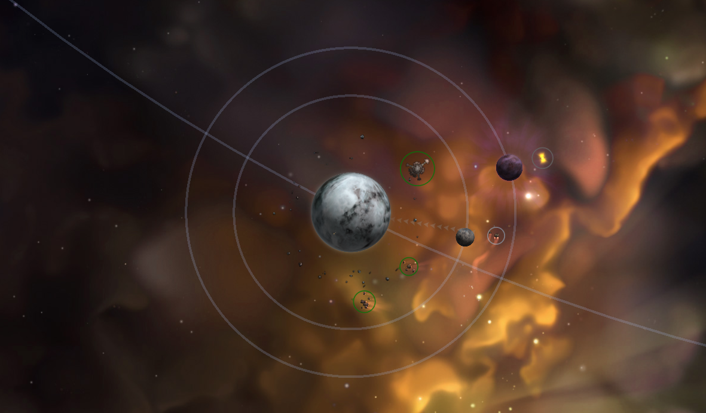

# Celestial Orbits

> "I kinda wish we had an orbital trajectory line for anything we lock onto in the map"  
> \- S0medudewhodoesthings, KMB "starsector-general" chat

That message is what got me going down a rabbit hole, although in the end not as 
deep as I thought, on how to make orbital trajectory lines show up for things that 
orbit around celestial objects. And thus, "Celestial Orbits" was born.

## What is "Celestial Orbits"?
By default, this mod allows you to learn and see the orbital trajectory of planetary 
bodies upon doing a full survey of a planet. Why a full survey of a planet? For 
gameplay ease-of-use reasons and not requiring you to stay in-system for the duration 
of a planets full rotation around its orbital focus, be it a star or another planet.
Although, *this **is** a setting you can enable*, if you want a more semi-realistic
way of surveying a planet's orbital trajectory.

### Features
- Visualising orbital trajectories of planetary bodies, stations, gates, and 
  jump-points within a system.
- [WIP] "Course focus", highlights or only shows the orbit of the course destination object. (Useful 
  for intercepting. Can be switched between or disabled in settings.)
- [WIP] A wide array of settings:
  - Change which celestial objects can show their orbit:
    - Only planetary bodies **(default)**
    - Stations included
    - All celestial objects
  - Change the learning/unlocking behavior:
    - "On Full Survey": Requires the player to fully survey a planet. **(default)**
    - "Always show": Shows every orbital trajectory.
    - "Witnessed": Requires you to spend a certain amount of time in the 
      system as a planet's rotation has passed to learn the orbital trajectory.
      - **Extra setting:** Choice between full, half, and third of the witnessed 
        rotation time required.
  - Change the "Course focus" behavior:
    - "Highlight": Highlights the course target's orbit. **(default)**
    - "Filter": Filters out the course target's orbit, showing only that orbit.
    - "Disabled": Disabled the functionality"

### TO-DO
- [ ] LunaSettings
  - [X] Visuals Behaviour
  - [X] Research Behaviour
  - [X] Research Time Required
  - [ ] Course Focus Behaviour
  - [X] Custom Orbit Color
  - [X] Orbit Color Picker
- [X] Survey tracking 

### F.A.Q. 
> Q: Can this be removed mid-save?  
> A: Yes, **BUT** with a requirement, being you **MUST** have left your save in hyperspace and not within a star system.

```
($market.surveyLevel) (SEEN, FULL)
($market.visitedBefore)
($market.isSurveyed) (TRUE/FALSE)
```

### Credits
- Fractal Softworks for the amazing game we all love to play
- Vexlia & Crablobab for helping me identify orbital junk entities
- Wymorlon for helping me think of a name for the mod
- Kaysaar for pointing me in the right direction of using custom entities & VoK's way of handling the Nidavelir
